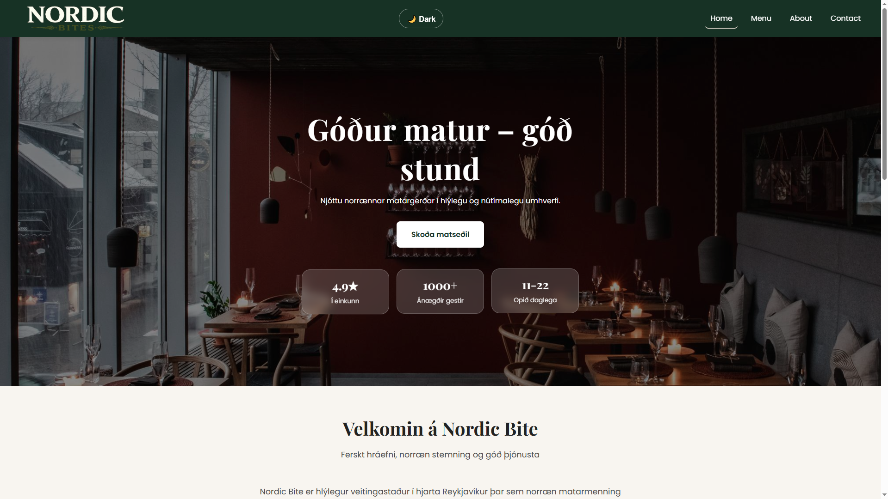
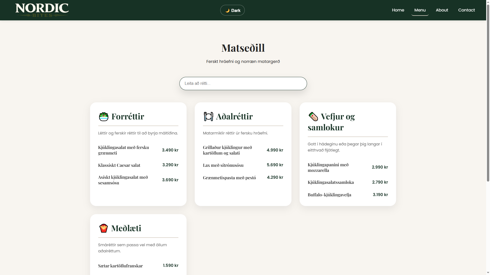
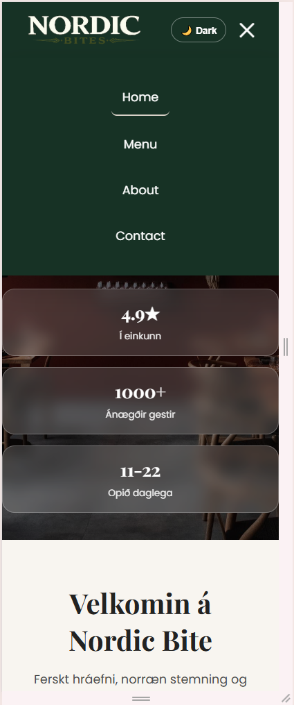
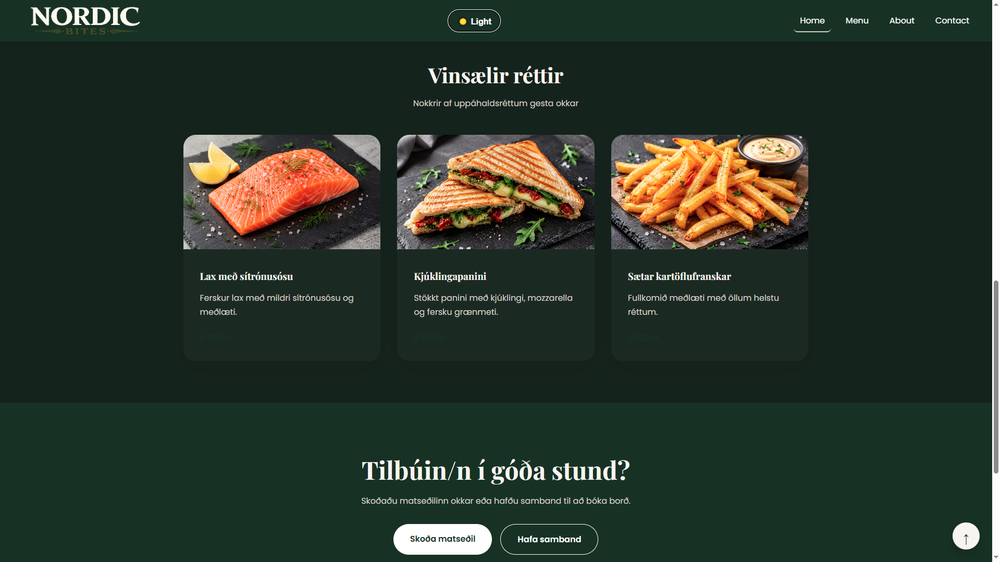

# Nordic Bite 🍽️

React + TypeScript lokaverkefni

**Slagorð:** _Góður matur – góð stund_

Nordic Bite er responsive landing page fyrir nýjan veitingastað sem sérhæfir sig í fersku hráefni og norrænni matarmenningu.

---

## 📸 Screenshots

### Forsíða



### Matseðill



### Mobile Navigation



### Dark Mode



## 🚀 Tækni

- React
- TypeScript
- React Router
- CSS3
- Vite

---

## ✨ Helstu eiginleikar

- Fully responsive hönnun
- Home síða með Hero section
- Matseðill byggður með `.map()`
- About Us síða
- Contact síða með form validation
- Google Maps staðsetning
- Dark / Light mode
- Sérsmíðuð 404 síða
- Mobile hamburger menu
- Smooth animations
- Custom favicon

---

## 📄 Síður

### Home

- Hero section
- Kynning á veitingastaðnum
- Vinsælir réttir
- Call-to-action section

### Menu

- Forréttir
- Aðalréttir
- Vefjur og samlokur
- Meðlæti

### About Us

- Saga og kynning á Nordic Bite
- Highlights
- Tölfræði um veitingastaðinn

### Contact

- Nafn
- Netfang
- Fyrirspurnategund
- Skilaboð
- Form validation
- Google Maps

---

## 📁 Verkefnaskipan

```text
src
│
├── assets
│   └── images
│
├── components
│   ├── BackToTop.tsx
│   ├── ContactForm.tsx
│   ├── Counter.tsx
│   ├── Footer.tsx
│   ├── Header.tsx
│   ├── Hero.tsx
│   ├── MenuCard.tsx
│   ├── PageWrapper.tsx
│   ├── ScrollToTop.tsx
│   ├── SectionTitle.tsx
│   └── ThemeToggle.tsx
│
├── data
│   └── menuData.ts
│
├── pages
│   ├── About.tsx
│   ├── Contact.tsx
│   ├── Home.tsx
│   ├── Menu.tsx
│   └── NotFound.tsx
│
├── styles
│   └── global.css
│
├── types
│   └── menu.ts
│
├── App.tsx
├── main.tsx
└── router.tsx
```

---

## 🛠️ Uppsetning

Clone-a repository:

```bash
git clone <repository-url>
```

Fara inn í verkefnið:

```bash
cd nordic-bites
```

Setja upp pakka:

```bash
npm install
```

Keyra verkefnið:

```bash
npm run dev
```

---

## 🎯 Markmið verkefnis

- Nota React á réttan hátt
- Nota reusable components
- Nota TypeScript
- Byggja responsive vefsíðu
- Skipuleggja verkefni á skýran hátt
- Nota gögn úr arrays og birta með `.map()`

---

## 👨‍💻 Höfundur

Elvar Finnur Grétarsson

Lokaverkefni í React + TypeScript.
